### Basic Network

|No.   |Figure   |Title   |Pub.  |Links|    
|-----|:-----:|:-----:|:-----:|:---:|   
|18|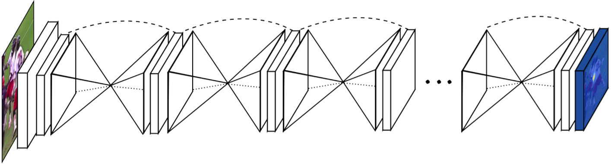|__Stacked Hourglass Networks for Human Pose Estimation__|__ECCV 2016__|[`Paper`](https://arxiv.org/abs/1603.06937) [`project`](http://www-personal.umich.edu/~alnewell/pose/) [`pytorch`](https://github.com/bearpaw/pytorch-pose)| 

### Depth Prediction / Completion

|No.   |Figure   |Title   |Pub.  |Links|    
|-----|:-----:|:-----:|:-----:|:---:|   
|19|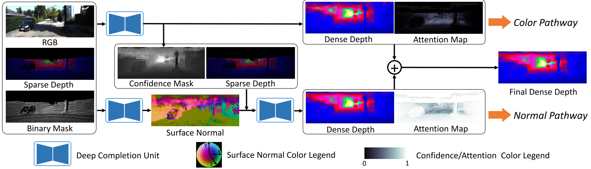|__DeepLiDAR: Deep Surface Normal Guided Depth Prediction for Outdoor Scene from Sparse LiDAR Data and Single Color Image__|__CVPR 2019__|[`Paper`](https://arxiv.org/abs/1812.00488)| 
|18|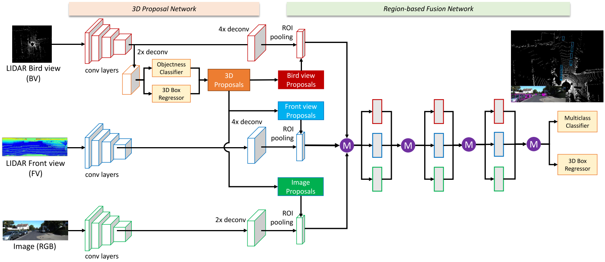|__Multi-View 3D Object Detection Network for Autonomous Driving__|__arxiv 2016__|[`Paper`](https://arxiv.org/abs/1611.07759) [`github`](https://github.com/bostondiditeam/MV3D)| 
|17|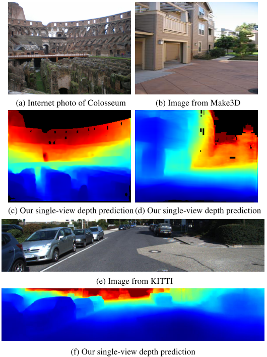|__MegaDepth: Learning Single-View Depth Prediction from Internet Photos__|__CVPR 2018__|[`Paper`](https://arxiv.org/abs/1804.00607) [`github`](https://github.com/lixx2938/MegaDepth)| 
|16|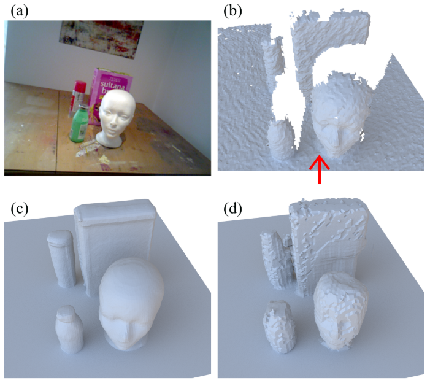|__Structured Prediction of Unobserved Voxels From a Single Depth Image__|__CVPR 2016__|[`Paper`](http://visual.cs.ucl.ac.uk/pubs/depthPrediction/) [`github`](https://github.com/mdfirman/voxlets) [`project`](http://visual.cs.ucl.ac.uk/pubs/depthPrediction/)| 
|16|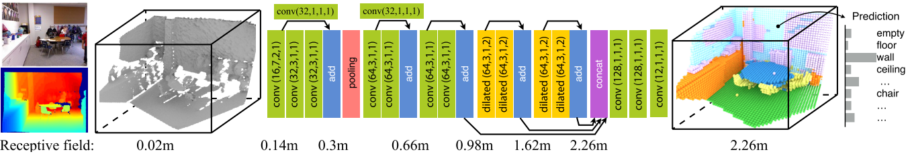|__Semantic Scene Completion from a Single Depth Image__|__CVPR 2017__|[`Paper`](https://arxiv.org/abs/1611.08974) [`github`](https://github.com/shurans/sscnet)| 
|15|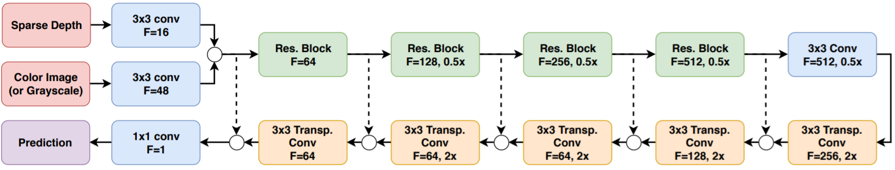|__Self-Supervised Sparse-to Dense: Self-Supervised Depth Completion from LiDAR and Monocular Camera__|__ICRA 2019__|[`Paper`](https://arxiv.org/pdf/1807.00275.pdf) [`github`](https://github.com/fangchangma/self-supervised-depth-completion)| 
|14||__Sparse-to-Dense: Depth Prediction from Sparse Depth Samples and a Single Image__|__ICRA 2018__|[`Paper`](https://arxiv.org/abs/1709.07492) [`github`](https://github.com/fangchangma/sparse-to-dense)| 
|13|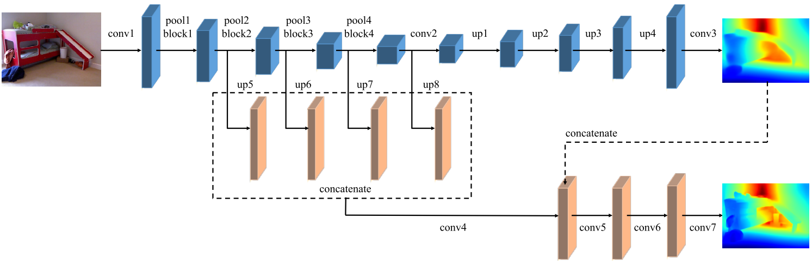|__Revisiting Single Image Depth Estimation: Toward Higher Resolution Maps with Accurate Object Boundaries__|__WACV 2019__|[`Paper`](https://arxiv.org/abs/1803.08673) [`github`](https://github.com/JunjH/Revisiting_Single_Depth_Estimation)| 
|12|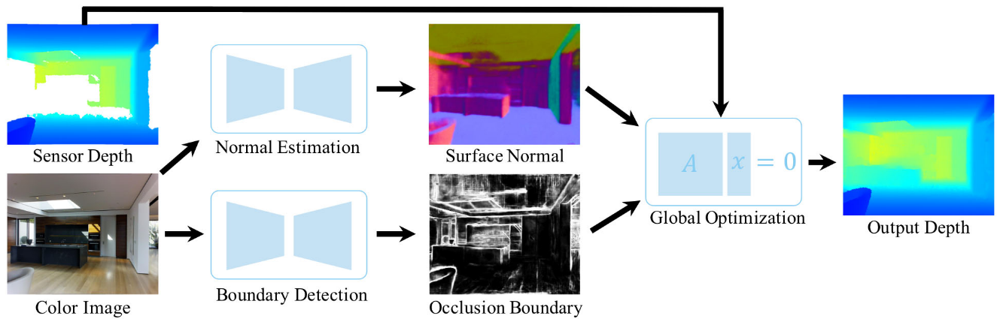|__Deep Depth Completion of a Single RGB-D Image__|__CVPR 2018__|[`Paper`](https://arxiv.org/abs/1803.09326) [`github`](https://github.com/yindaz/DeepCompletionRelease)| 
|11|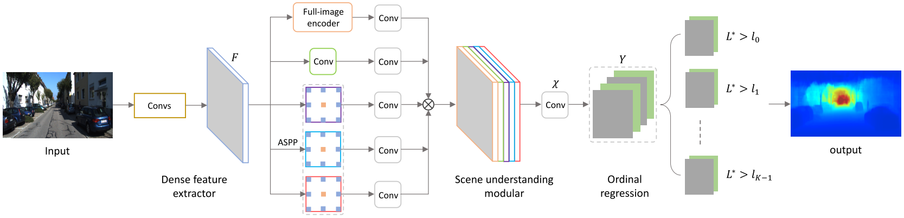|__Deep Ordinal Regression Network for Monocular Depth Estimation__|__CVPR 2018__|[`Paper`](https://arxiv.org/abs/1806.02446) [`github`](https://github.com/hufu6371/DORN)| 
|10|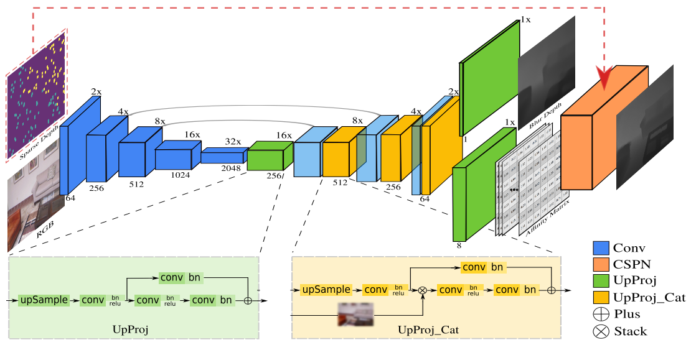|__Depth Estimation via Affinity Learned with Convolutional Spatial Propagation Network__|__ECCV 2018__|[`Paper`](https://arxiv.org/abs/1808.00150) [`github`](https://github.com/XinJCheng/CSPN)| 
|9|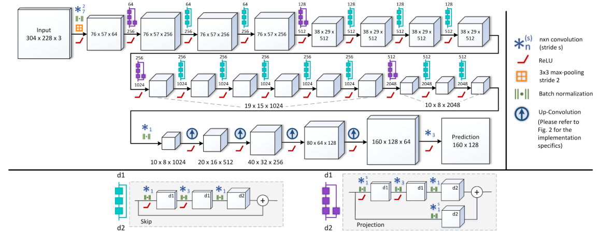|__Deeper Depth Prediction with Fully Convolutional Residual Networks__|__3DV 2016__|[`Paper`](https://arxiv.org/abs/1606.00373) [`github`](https://github.com/iro-cp/FCRN-DepthPrediction)| 
|8|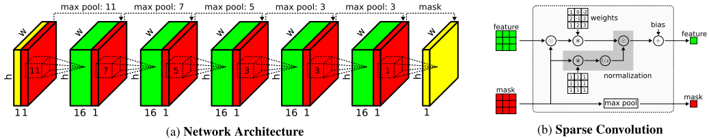|__Sparsity Invariant CNNs__|__3DV 2017__|[`Paper`](https://arxiv.org/abs/1708.06500) [`github`](https://github.com/yxgeee/DepthComplete)| 
|7|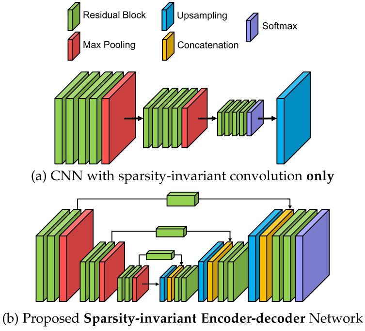|__HMS-Net: Hierarchical Multi-scale Sparsity-invariant Network for Sparse Depth Completion__|__arxiv 2018__|[`Paper`](https://arxiv.org/abs/1808.08685)| 
|6|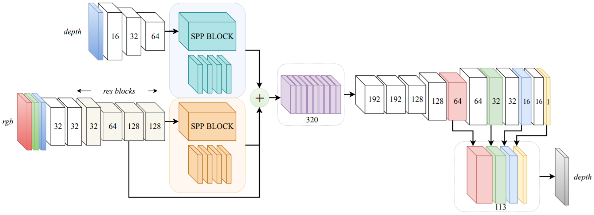|__DFuseNet: Deep Fusion of RGB and Sparse Depth Information for Image Guided Dense Depth Completion__|__arxiv 2019__|[`Paper`](https://arxiv.org/pdf/1902.00761.pdf) [`github`](https://github.com/ShreyasSkandanS/DFuseNet)|  
|5|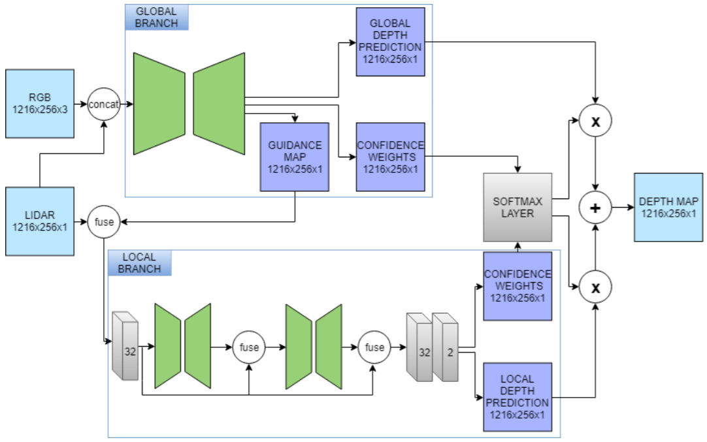|__Sparse and noisy LiDAR completion with RGB guidance and uncertainty__|__arxiv 2019__|[`Paper`](https://arxiv.org/abs/1902.05356) [`github`](https://github.com/wvangansbeke/Sparse-Depth-Completion)|  
|4|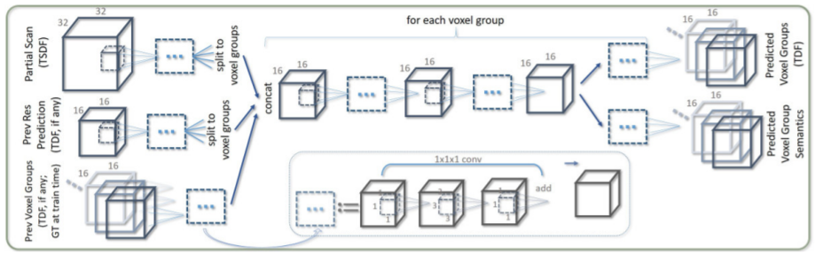|__ScanComplete: Large-Scale Scene Completion and Semantic Segmentation for 3D Scans__|__CVPR 2018__|[`Paper`](https://arxiv.org/pdf/1712.10215.pdf) [`github`](https://github.com/angeladai/ScanComplete) [`Notes`](PaperReading/2018_CVPR_ScanComplete_Large_Scale_Scene_Completion_and_Semantic_Segmentation_for_3D_Scans.md)|  
|3|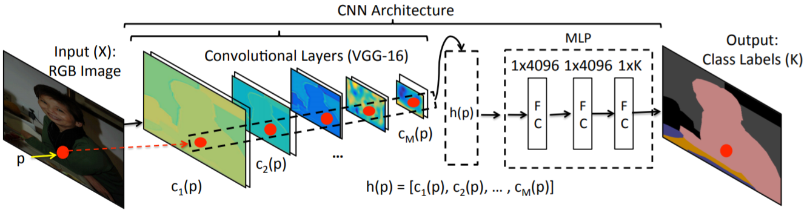|__PixelNet: Representation of the pixels, by the pixels, and for the pixels__|__arxiv 2017__|[`Paper`](http://www.cs.cmu.edu/~aayushb/pixelNet/pixelnet.pdf) [`Homepage`](http://www.cs.cmu.edu/~aayushb/pixelNet/) [`github`](https://github.com/aayushbansal/PixelNet) [`Notes`](2017_arxiv_PixelNet_Representation_of_the_pixels_by_the_pixels_and_for_the_pixels.md)| 
|2|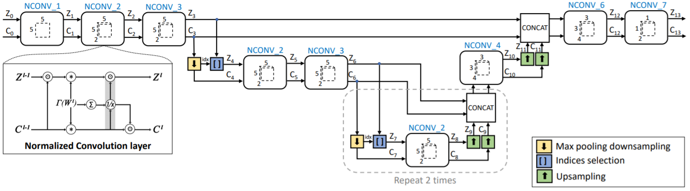|__Propagating Confidences through CNNs for Sparse Data Regression__|__BMVC 2018__|[`Paper`](https://arxiv.org/abs/1805.11913) [`Paper`](https://arxiv.org/abs/1811.01791) [`github`](https://github.com/abdo-eldesokey/nconv) [`Notes`](PaperReading/2018_arxiv_Propagating_Confidences_through_CNNs_for_Sparse_Data_Regression.md)|  
|1|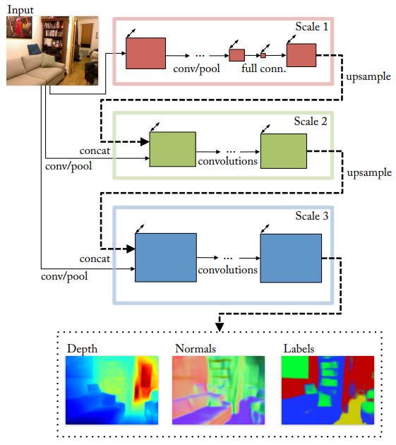|__Predicting Depth, Surface Normals and Semantic Labels with a Common Multi-Scale Convolutional Architecture__|__ICCV 2015__|[`Paper`](https://arxiv.org/pdf/1411.4734v4.pdf) [`Homepage`](https://cs.nyu.edu/~deigen/dnl/) [`Notes`](PaperReading/2015_ICCV_Predicting_Depth_Surface_Normals_and_Semantic_Labels_with_a_Common_Multi_Scale_Convolutional_Architecture.md)|  

### Saliency Detection

|No.   |Figure   |Title   |Pub.  |Links|    
|-----|:-----:|:-----:|:-----:|:---:|   
|8|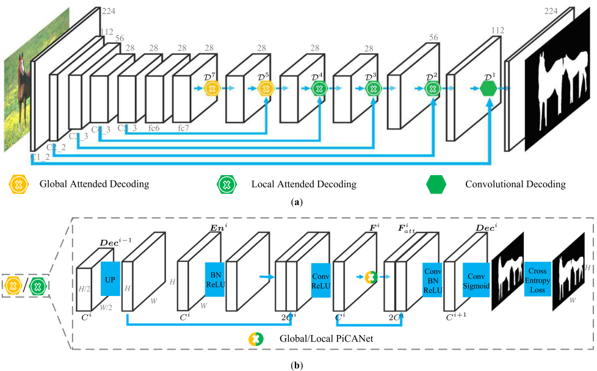|__PiCANet: Learning Pixel-wise Contextual Attention for Saliency Detection__|__CVPR 2018__|[`Paper`](https://arxiv.org/abs/1708.06433)  [`github`](https://github.com/nian-liu/PiCANet) |  
|7|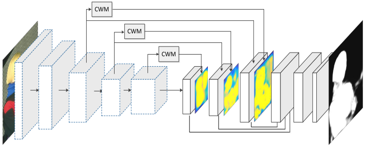|__Detect Globally, Refine Locally: A Novel Approach to Saliency Detection__|__CVPR 2018__|[`Paper`](https://drive.google.com/file/d/17MyYRD5kbSFMn0bw7s5pbmWRU-R6_LiR/view)  [`github`](https://github.com/TiantianWang/CVPR18_detect_globally_refine_locally) |  
|6|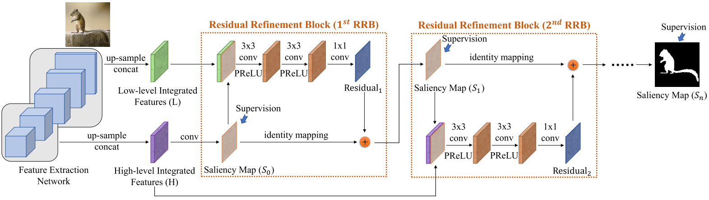|__R3Net: Recurrent Residual Refinement Network for Saliency Detection__|__IJCAI 2018__|[`Paper`](https://www.ijcai.org/proceedings/2018/0095.pdf)  [`github`](https://github.com/zijundeng/R3Net) |  
|5|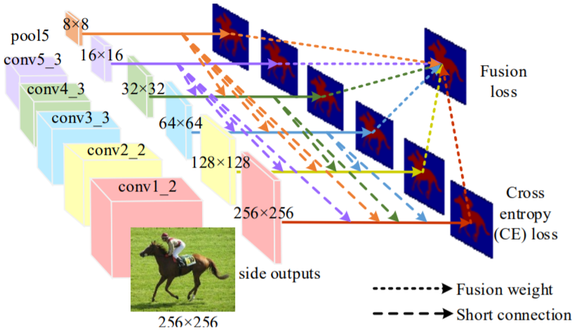|__Deeply Supervised Salient Object Detection with Short Connections__|__CVPR 2017__|[`Paper`](https://arxiv.org/abs/1611.04849) [`github`](https://github.com/Andrew-Qibin/DSS) |  
|4|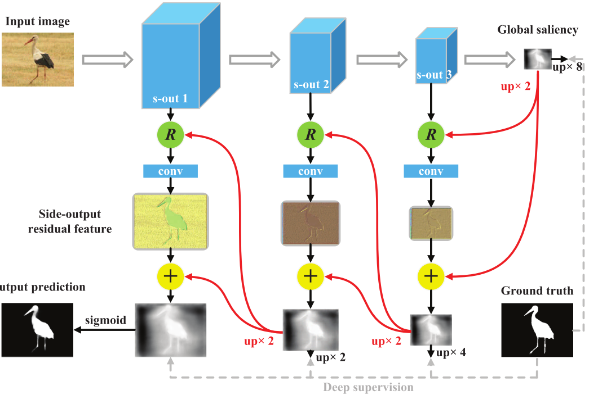|__Reverse Attention for Salient Object Detection__|__ECCV 2018__|[`Paper`](http://openaccess.thecvf.com/content_ECCV_2018/papers/Shuhan_Chen_Reverse_Attention_for_ECCV_2018_paper.pdf) [`github`](https://github.com/ShuhanChen/RAS_ECCV18) |  
|3|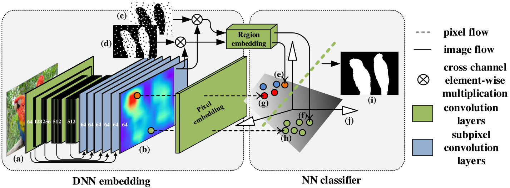|__Learning to Promote Saliency Detectors__|__CVPR 2018__|[`Paper`](https://drive.google.com/file/d/1sGSMt8ZPZNFaStwiAeS6jkeBURSDHtO0/view) [`github`](https://github.com/zengxianyu/lps) |  
|2|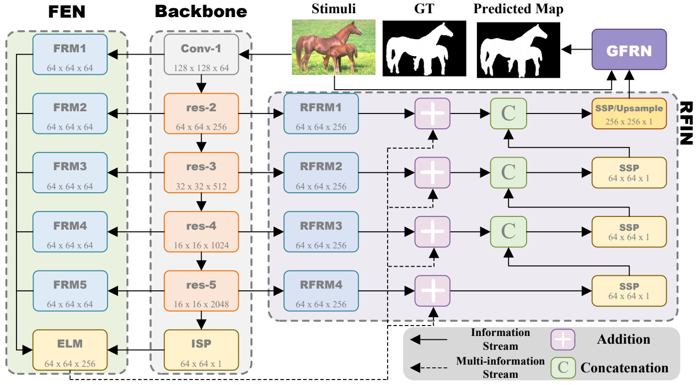|__Deep Embedding Features for Salient Object Detection__|__AAAI 2019__|[`Paper`](https://drive.google.com/file/d/1l02_GtoMxRFy9IJifSjs-zjYOOQWoBfx/view) [`notes`](PaperReading/2019_AAAI_RFIN.md) |  
|1||__Salient Object Detection by Lossless Feature Reflection__|__IJCAI 2018__|[`Paper`](https://arxiv.org/pdf/1411.4734v4.pdf) [`github`](https://github.com/Pchank/caffe-sal/blob/master/IIAU2018.md) |  

